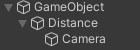
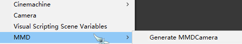
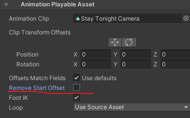
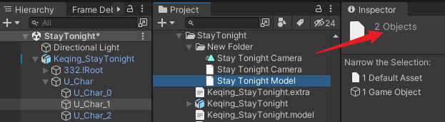

# MMD6UnityTool

May be used when you use Unity to make MMD

For export **camera** and **morph** animations from VMD.
 If you want to convert PMX to FBX, you can try using [MMD4Mecanim](https://stereoarts.jp/)
 

> For ease of use, directly copied from the following project, put it in a menu and made some modifications.
Therefore, please refer to the LICENSE of the original projects  
[MMD2UnityTool](https://github.com/MorphoDiana/MMD2UnityTool) 
[MMD4UnityTools](https://github.com/ShiinaRinne/MMD4UnityTools)

~~2+4=6~~

## Demo
[Miku お気に召すまま](https://www.bilibili.com/video/BV1eY411o7Dd/)

<!-- ## Known Issue -->

## Usage

### For camera animation 
  just right click on VMD file and select `MMD/Create Camera Anim` 
  Based on the structure of anim, you need to make the camera conform to this structure 
  
  #### Method1 
  1. Create two empty objects in the scene and set their parent
  2. Add `Animator component` to the top-level object (yes, not to Camera)
  3. Rename the middle object to `Distance`
  4. Rotate "Distance" 180 degrees in the Y axis
  #### Method 2
  Use the tool script to create it with just one click  
  But it will create an additional Camera, and you may need to adjust the `GenerateMMDCamera` method in `MMD6UnityTool/Editor/AnimationHelpers.cs` (after line 115) for you own needs  
  

  When you use camera animation via Timeline, remember uncheck `Remove Start Offset` in Clip properties 
  

### For morph animation 
  you need to select the object in the scene that contains the blendshapes of the face under the model
  (If it is generated by MMD4Mecanim, it is usually `your model/U_Char/U_Char_1`) 
  and select the VMD with morph (ie: multi selection) 
    
  Then right click and select `MMD/Create Morph Anim`

## [Not Important] If you want to control Post-Process Volume via Timeline, feel free to try this repo
[TimelineExtensions](https://github.com/ShiinaRinne/TimelineExtensions)

## License
[MIT License](https://github.com/ShiinaRinne/MMD6UnityTool/blob/master/LICENSE)

## Require
Unity 2021 or later